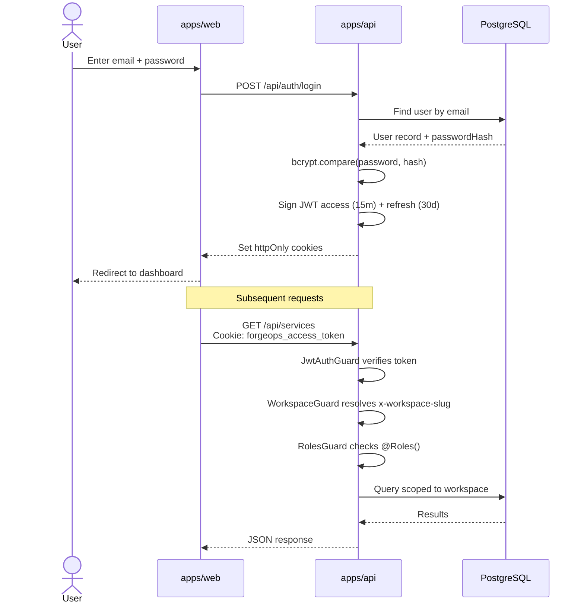
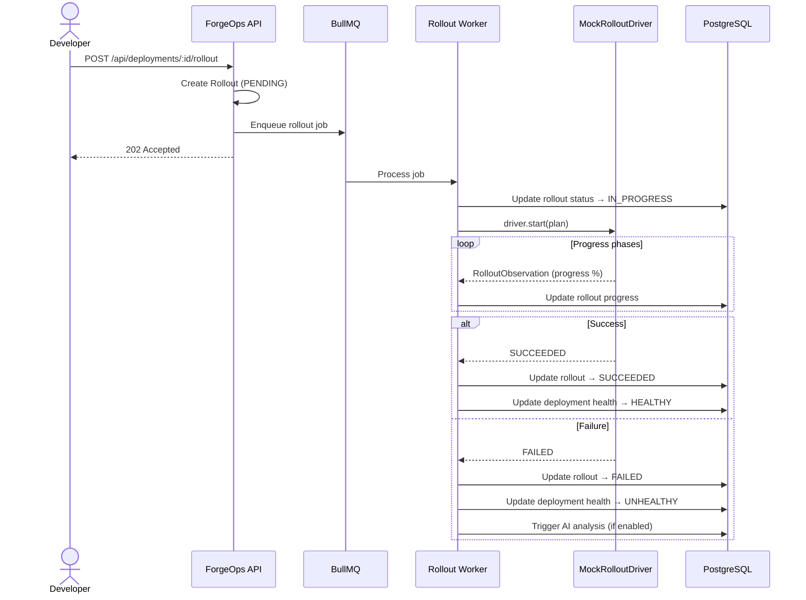
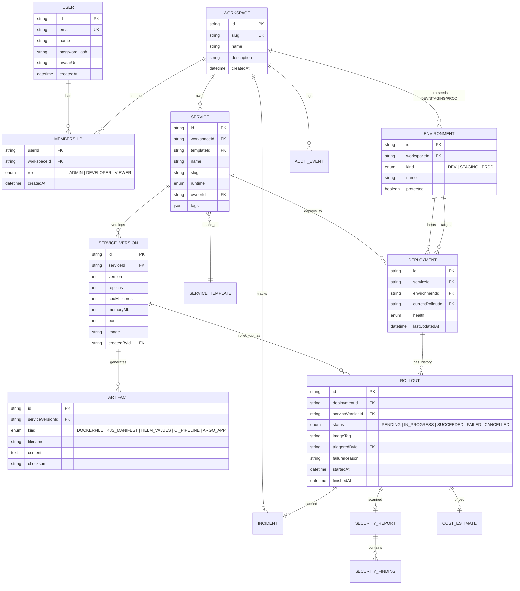

# Architecture

> How ForgeOps is built, how the pieces fit together, and why.

## System Overview

ForgeOps is a **monorepo-based internal developer platform (IDP)** following a modular, ports-and-adapters architecture. It consists of two applications sharing typed contracts through a set of internal packages.

```
┌─────────────────────────────────────────────────────────────────┐
│                         Monorepo (pnpm + Turborepo)             │
│                                                                 │
│  ┌──────────────┐    ┌──────────────┐    ┌──────────────────┐  │
│  │  apps/web     │    │  apps/api     │    │  packages/*      │  │
│  │  Next.js 15   │───▶│  NestJS 10    │◀───│  types, ui,      │  │
│  │  (App Router) │    │  (REST + WS)  │    │  templates,      │  │
│  └──────────────┘    └──────┬───────┘    │  config-*        │  │
│                             │            └──────────────────┘  │
│                             │                                   │
│                    ┌────────┴────────┐                          │
│                    │   Providers     │                          │
│                    │  (adapters)     │                          │
│                    └────────┬────────┘                          │
│                             │                                   │
│              ┌──────────────┼──────────────┐                   │
│              ▼              ▼              ▼                    │
│         PostgreSQL 16   Redis 7      External APIs             │
│         (Prisma ORM)    (BullMQ)     (Anthropic, K8s, etc.)    │
└─────────────────────────────────────────────────────────────────┘
```

### Architectural Principles

| Principle | Implementation |
|---|---|
| **Monorepo** | pnpm workspaces + Turborepo for task orchestration and build caching |
| **Ports & Adapters** | Every external integration (rollouts, security, metrics, logs, AI, artifact publishing) lives behind a provider interface. Swapping mock for real is a config change, not a refactor. |
| **Workspace isolation** | Every domain entity is scoped to a `Workspace`. The `WorkspaceGuard` resolves workspace context from the `x-workspace-slug` header on every request. |
| **Platform-managed environments** | DEV, STAGING, PROD are auto-created per workspace. PROD is `protected: true`. Users cannot create or delete environments. |
| **Typed contracts** | Zod schemas in `packages/types` are the single source of truth. Both frontend and backend import the same schemas. |
| **AI is optional** | Gated by `FEATURE_AI_COPILOT_ENABLED`. The deterministic analyzer always works; Claude is an enhancement, not a requirement. |

---

## Component Diagram

```mermaid
graph TB
    subgraph "Frontend (apps/web)"
        NextJS["Next.js 15<br/>App Router + RSC"]
        TanStackQ["TanStack Query"]
        Zustand["Zustand Store"]
        ShadcnUI["shadcn/ui + Tailwind v4"]
    end

    subgraph "Backend (apps/api)"
        NestJS["NestJS 10"]
        AuthMod["Auth Module"]
        WSMod["Workspaces Module"]
        SvcMod["Services Module"]
        DeployMod["Deployments Module"]
        GenMod["Generator Module"]
        SecMod["Security Module"]
        CostMod["Cost Module"]
        ObsMod["Observability Module"]
        AIMod["AI Module"]
        AuditMod["Audit Module"]
        QMod["Queues Module"]
    end

    subgraph "Provider Layer"
        RolloutP["RolloutDriver<br/>(mock | k8s)"]
        SecP["SecurityScanner<br/>(mock | trivy)"]
        MetricsP["MetricsProvider<br/>(mock | prometheus)"]
        LogsP["LogsProvider<br/>(mock | loki)"]
        ArtP["ArtifactPublisher<br/>(db | git)"]
        AIP["AiProvider<br/>(deterministic | claude)"]
    end

    subgraph "Data Layer"
        Prisma["Prisma ORM"]
        PG["PostgreSQL 16"]
        Redis["Redis 7"]
        BullMQ["BullMQ"]
    end

    subgraph "Shared Packages"
        TypesPkg["packages/types<br/>Zod schemas"]
        UIToolkit["packages/ui<br/>shadcn components"]
        TmplPkg["packages/templates<br/>Handlebars templates"]
    end

    NextJS -->|"REST + cookies"| NestJS
    TanStackQ --> NestJS
    NestJS --> AuthMod
    NestJS --> WSMod
    NestJS --> SvcMod
    NestJS --> DeployMod
    NestJS --> GenMod
    NestJS --> SecMod
    NestJS --> CostMod
    NestJS --> ObsMod
    NestJS --> AIMod
    NestJS --> AuditMod
    NestJS --> QMod

    SvcMod --> Prisma
    DeployMod --> RolloutP
    DeployMod --> Prisma
    GenMod --> ArtP
    GenMod --> TmplPkg
    SecMod --> SecP
    ObsMod --> MetricsP
    ObsMod --> LogsP
    AIMod --> AIP
    QMod --> BullMQ
    BullMQ --> Redis
    Prisma --> PG

    NextJS --> TypesPkg
    NestJS --> TypesPkg
    NextJS --> UIToolkit

    style NextJS fill:#0ea5e9,color:#fff
    style NestJS fill:#e0245e,color:#fff
    style Prisma fill:#2d3748,color:#fff
    style PG fill:#336791,color:#fff
    style Redis fill:#dc382d,color:#fff
```



---

## Authentication Flow



---

## Deployment & Rollout Lifecycle



---

## Provider / Adapter Pattern

Every external integration follows the same pattern:

```
providers/<name>/
├── <name>.interface.ts      # TypeScript interface + Symbol injection token
├── mock-<name>.ts           # Deterministic mock implementation
├── <name>.module.ts         # Factory module (picks impl based on config)
└── [real-<name>.ts]         # Production implementation (future)
```

### Current Providers

| Provider | Token | Mock | Config key | Future real |
|---|---|---|---|---|
| **Rollout** | `ROLLOUT_DRIVER` | `MockRolloutDriver` | `PROVIDER_ROLLOUT` | `KubernetesRolloutDriver` |
| **Security** | `SECURITY_SCANNER` | `MockSecurityScanner` | `PROVIDER_SECURITY` | Trivy / Snyk |
| **Metrics** | `METRICS_PROVIDER` | `MockMetricsProvider` | `PROVIDER_METRICS` | Prometheus |
| **Logs** | `LOGS_PROVIDER` | `MockLogsProvider` | `PROVIDER_LOGS` | Loki |
| **Artifact** | `ARTIFACT_PUBLISHER` | `DbArtifactPublisher` | `PROVIDER_ARTIFACT_PUBLISHER` | `GitArtifactPublisher` |
| **AI** | `AI_PROVIDER` | `DeterministicAiProvider` | `FEATURE_AI_COPILOT_ENABLED` | `ClaudeAiProvider` |

The factory module reads a config value and returns the appropriate implementation:

```typescript
// Example: rollout.module.ts
{
  provide: ROLLOUT_DRIVER,
  inject: [ConfigService],
  useFactory: (config: ConfigService) => {
    const provider = config.get('PROVIDER_ROLLOUT', 'mock');
    switch (provider) {
      case 'mock': return new MockRolloutDriver();
      case 'kubernetes': return new KubernetesRolloutDriver(); // future
      default: throw new Error(`Unknown rollout provider: ${provider}`);
    }
  },
}
```

---

## Request Pipeline

Every API request passes through this pipeline:

```
Request
  → helmet (security headers)
  → CORS
  → cookie-parser
  → JwtAuthGuard (verify access token from httpOnly cookie)
  → WorkspaceGuard (resolve workspace from x-workspace-slug header)
  → RolesGuard (check @Roles() metadata against membership role)
  → AuditInterceptor (log action to AuditEvent table on success)
  → ZodValidationPipe (validate body with Zod schemas)
  → Controller → Service → Prisma → PostgreSQL
  → AllExceptionsFilter (normalize error responses)
  → Response
```

---

## Database Schema (Entity Relationship)



---

## Directory Structure

```
forgeops/
├── apps/
│   ├── api/                           NestJS backend
│   │   ├── prisma/
│   │   │   ├── schema.prisma          18-table domain model
│   │   │   ├── seed.ts                Realistic demo data
│   │   │   └── migrations/            Prisma migration files
│   │   └── src/
│   │       ├── main.ts                Bootstrap: helmet, cookie-parser, Swagger, CORS
│   │       ├── app.module.ts          Root module wiring all providers + domain modules
│   │       ├── config/
│   │       │   ├── configuration.ts   Typed config loader from process.env
│   │       │   └── env.schema.ts      Zod-based env validation
│   │       ├── common/
│   │       │   ├── decorators/        @CurrentUser, @CurrentWorkspace, @Roles, @Audit, @Public
│   │       │   ├── guards/            JwtAuthGuard, WorkspaceGuard, RolesGuard
│   │       │   ├── interceptors/      AuditInterceptor (cross-cutting audit trail)
│   │       │   ├── pipes/             ZodValidationPipe
│   │       │   ├── filters/           AllExceptionsFilter
│   │       │   └── types/             ForgeOpsRequest, AuthenticatedUser, WorkspaceContext
│   │       ├── prisma/                PrismaService + PrismaModule
│   │       ├── providers/             Pluggable adapters (see Provider Pattern above)
│   │       │   ├── rollout/
│   │       │   ├── security/
│   │       │   ├── metrics/
│   │       │   ├── logs/
│   │       │   ├── artifact-publisher/
│   │       │   └── ai/
│   │       └── modules/               Domain modules
│   │           ├── auth/              Register, login, refresh, logout (JWT cookies)
│   │           ├── users/             Profile CRUD
│   │           ├── workspaces/        Workspace CRUD + member management
│   │           ├── audit/             Audit event recording + query
│   │           ├── services/          Service catalog
│   │           ├── templates/         Template registry
│   │           ├── generator/         Artifact generation (Dockerfile, K8s, Helm, CI, Argo)
│   │           ├── deployments/       Deployment + rollout management
│   │           ├── security/          Security scan orchestration
│   │           ├── cost/              Cost estimation
│   │           ├── observability/     Metrics + incidents
│   │           ├── ai/                AI copilot (analyze, chat)
│   │           ├── queues/            BullMQ queue management
│   │           ├── health/            /healthz + /readyz
│   │           └── feature-flags/     Runtime feature flag query
│   │
│   └── web/                           Next.js 15 frontend
│       └── src/
│           ├── app/
│           │   ├── layout.tsx         Root layout (dark mode, Inter font)
│           │   ├── page.tsx           Landing page
│           │   └── globals.css        OKLCH dark theme + shadcn CSS vars
│           └── lib/
│               └── utils.ts           cn() helper (clsx + tailwind-merge)
│
├── packages/
│   ├── types/                         Shared Zod schemas + TypeScript types
│   │   └── src/
│   │       ├── index.ts               Barrel export
│   │       ├── common.ts              Pagination, pageResult, idSchema
│   │       ├── enums.ts               All domain enums (mirrors Prisma)
│   │       ├── auth.ts                loginSchema, signupSchema, SessionUser
│   │       ├── workspaces.ts          createWorkspaceSchema, inviteMemberSchema
│   │       ├── services.ts            createServiceSchema, serviceConfigSchema
│   │       ├── deployments.ts         triggerRolloutSchema, rollbackSchema
│   │       ├── security.ts            SecurityReportSummary, SecurityFindingSummary
│   │       ├── cost.ts                CostBreakdown, CostSuggestion
│   │       ├── artifacts.ts           ArtifactSummary, ArtifactKind
│   │       ├── ai.ts                  AiAnalysisResult, aiChatSchema
│   │       ├── observability.ts       MetricSamplePoint, IncidentSummary
│   │       └── feature-flags.ts       FeatureFlags interface
│   ├── ui/                            Shared shadcn/ui components
│   ├── templates/                     Handlebars template registry + artifact templates
│   ├── config-typescript/             Shared tsconfig presets (base, node, next)
│   └── config-eslint/                 Shared ESLint flat-config presets (base, react, node)
│
├── infra/
│   ├── docker-compose.yml             Postgres 16, Redis 7, Mailhog
│   └── docker/
│       ├── Dockerfile.api             Multi-stage build for NestJS
│       └── Dockerfile.web             Multi-stage build for Next.js
│
├── graphify-out/                      Knowledge graph (auto-generated)
│   ├── GRAPH_REPORT.md                Audit report with communities, god nodes
│   ├── graph.json                     Raw graph data (GraphRAG-ready)
│   └── graph.html                     Interactive visualization
│
├── turbo.json                         Turborepo task config
├── pnpm-workspace.yaml                Workspace packages declaration
├── .env.example                       Environment variable template
└── package.json                       Root scripts: dev, build, db:migrate, docker:up
```

---

## Tech Stack

| Layer | Technology | Version |
|---|---|---|
| **Runtime** | Node.js | >= 20.10 |
| **Package manager** | pnpm | 10.x |
| **Build orchestrator** | Turborepo | 2.x |
| **Language** | TypeScript | 5.x (strict) |
| **Backend framework** | NestJS | 10.x |
| **ORM** | Prisma | 5.x |
| **Database** | PostgreSQL | 16 |
| **Cache / Queue** | Redis 7 + BullMQ | - |
| **Auth** | JWT (access+refresh) in httpOnly cookies, bcrypt | - |
| **Validation** | Zod + class-validator | - |
| **API docs** | Swagger (OpenAPI 3.0) | - |
| **Frontend framework** | Next.js (App Router) | 15.x |
| **CSS** | Tailwind CSS v4 + shadcn/ui | - |
| **State** | TanStack Query + Zustand + nuqs | - |
| **AI** | Anthropic Claude (via Vercel AI SDK) | Sonnet 4.6 / Haiku 4.5 |
| **Logging** | Pino (via nestjs-pino) | - |
| **Email** | Mailhog (dev), SMTP (prod) | - |
| **Containerization** | Docker (multi-stage, node:22-bookworm-slim) | - |
